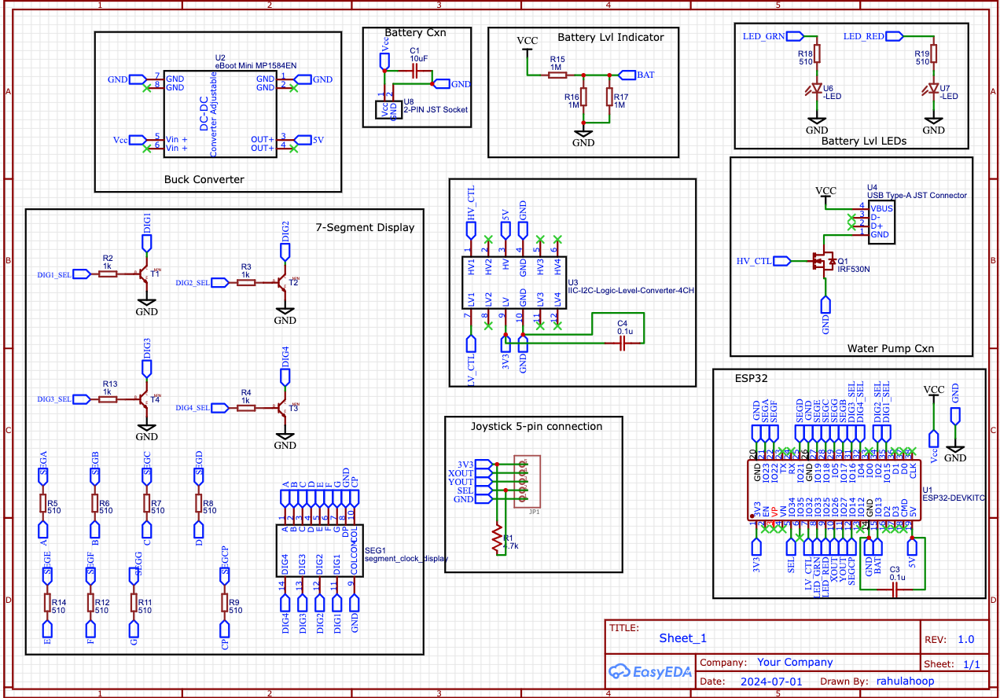

## What is this?
A hobby project that came about after too many of my plants died because I forgot to water them.

This project consists of an ESP32 microcontroller atop a custom PCB. The ESP32 drives water pump that is attached to the board via JST connector.
You can set how long and how often the pump will turn on via a joystick and a seven-segment hex display. The interface is fairly intuitive:
just hold down the joystick until the display starts blinking. From there you can set the duration and frequency at which the pump turns on.
Hold down the joystick again until the display turns solid. At this point it just displays the time, in days and hours, until the pump will
turn back on.

The board is battery-powered, so you can put it pretty much anywhere in your house. This feature is currently untested, but when the battery
voltage gets too low, a red LED on the board will turn on. However, the ESP32 will go into deep sleep mode to conserve power, so this
hopefully shouldn't happen to often. To wake up the board, just click on the joystick!

## Components
This was all done in the Arduino IDE, which I realize I strongly dislike and will move away from for future projects.
The ESP32 is the main workhorse of this project. It manages all the sensors, including the joystick / display state machine, and
saves state before entering deep sleep. 

The ESP32 is battery-powered. Apparently you have to be pretty careful with the input voltages that you use to power up the board 
(the microcontroller basically cannot accept anything more than 5V). I included an adjustable buck-converter to step the 9V from my
battery down to 5V.

The water pump is a 5W PULACO water pump with a USB connector. It connects to the main PCB via a USB breakout board that you can get off Amazon
[link](https://www.amazon.com/gp/product/B09WQHPXH6/ref=ppx_yo_dt_b_search_asin_title?ie=UTF8&psc=1). 

As the ESP32 cannot supply enough power by itself to drive the board, I instead used an IRF530 MOSFET paired with a 3.3v -> 5v logic level converter.
The logic-level converter was necessary because the ESP32 GPIOs can only swing up to 5v, and the IRF530, which was the only power transistor
I had on hand, would only turn on if the gate voltage was at least 5V. In hindsight, it would have saved board space to just purchase a 3.3v
transistor. But I already had the converter and IRF530 on hand, so decided against spending more money.

The seven-segment display consists of four digits, each consisting of seven segments (hence the name). It driven by 13 GPIOs! Four GPIOs are used to select 
one of the four digits that are available on the display; seven are used to turn on the 7 segments within a digit; one is used to turn on the colon in the 
center of the display; and one ground pin. 

To turn on any individual segment on the first digit, you have to select pull the digit pin low and also assert the pin associated with that segment. 
To display something meaningful on the display, like a bunch of numbers, you have to rapidly enable a digit, light up all the segments that make
up a number, then turn off all the digits and switch over to the next digit. If you do this fast enough, the display will appear to show a persistent
sequence of numbers (at least to our mortal human eyes). 

The display, as mentioned before, consumes 13 GPIOs on the ESP32 - a lot of real estate. In the future I'd probably add a serial-to-parallel
shift register onto the board. That way I could use a single GPIO on the ESP32 to control the entire display!

## Circuit Diagram

I designed the PCB with EasyEDA and had it printed out through JLCPCB.

